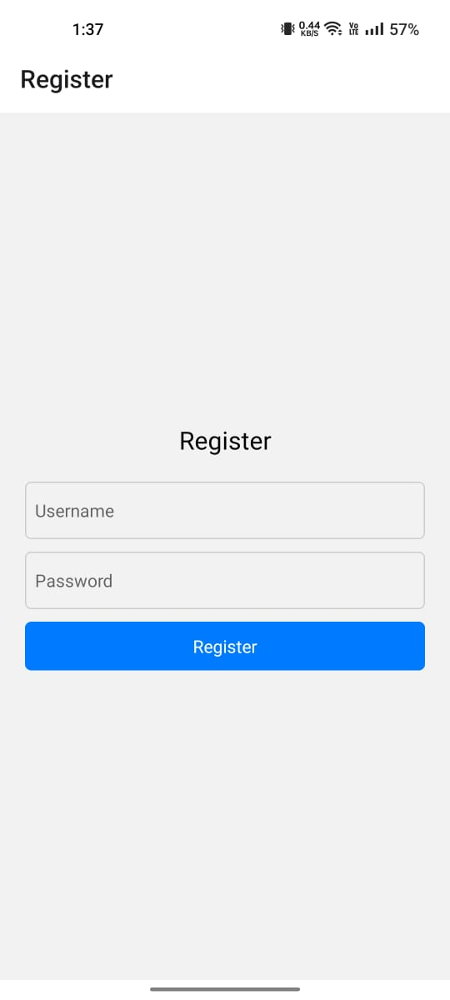
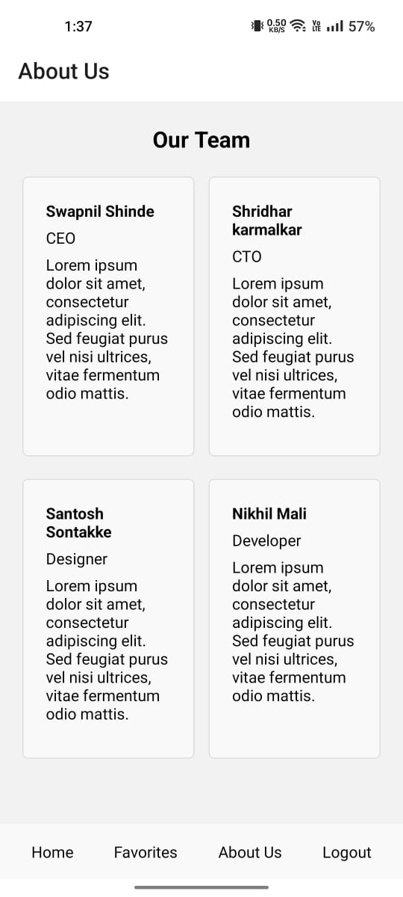

# Recipe App

Welcome to the Recipe App! This web application allows users to search for recipes, view recipe details, add recipes to favorites, and more.

## Features

- **Search Recipes**: Users can search for recipes using keywords.
- **View Recipe Details**: Detailed information about each recipe is available, including ingredients, calories, and health labels.
- **Add to Favorites**: Users can add recipes to their favorites list for easy access later.
- **Responsive Design**: The app is responsive and works well on desktop and mobile devices.

## Technologies Used

- react native expo
- React Router
- Edamam API (for recipe data)

## Getting Started

To run the project locally, follow these steps:

1. Clone the repository: `git clone https://github.com/Swapnil11007/food_recipe_finder_app
2. Navigate to the project directory: `cd recipe-app`
3. Install dependencies: `npm install`
4. Start the development server: `npm start`

The app should now be running at [http://localhost:3000](http://localhost:3000).

## Screenshots

### Dashboard Page

### Recipe Detail Page

### Favorites Page

### search Page

### loginPage Page

### RegisterPage Page

### aboutUs Page

# github

https://github.com/Swapnil11007/food_recipe_finder_app

# Auther

Swapnil Shinde
